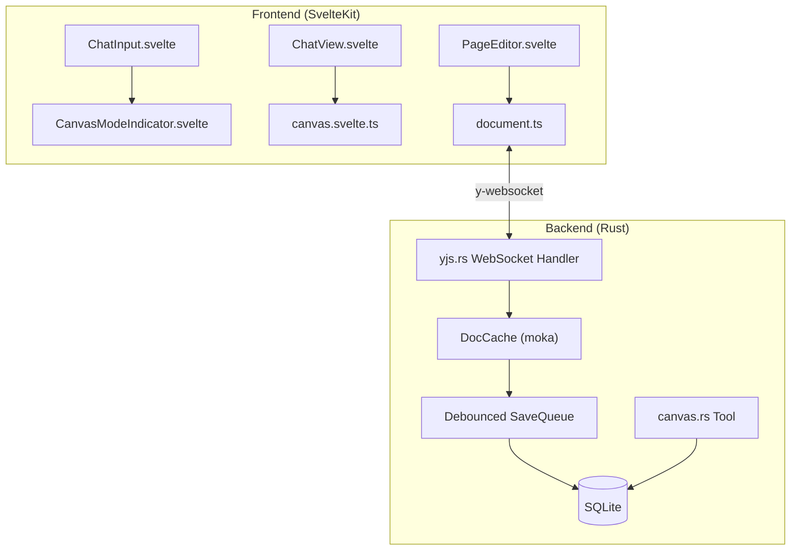

# Canvas Mode Implementation Plan

## Architecture Overview



## Key Simplifications from Original Plan

1. **Single UndoManager with count tracking** - No stack item references, just increment/decrement
2. **Explicit binding with AI fallback** - Toolbar button + inline "needs_binding" component
3. **moka cache with TTL** - Auto-eviction after 30 min, max 100 pages
4. **Server-side content initialization** - Client never initializes, only server does

---

## Phase 1: Dependencies and Schema

### 1.1 Frontend Packages

```bash
cd apps/web
pnpm add yjs y-codemirror.next y-websocket y-indexeddb y-protocols
```

### 1.2 Rust Crates

Add to [core/Cargo.toml](core/Cargo.toml):

```toml
yrs = "0.18"
y-sync = "0.4"
moka = { version = "0.12", features = ["sync"] }
```

### 1.3 Database Migration

Create `core/migrations/005_yjs_support.sql`:

```sql
-- Yjs state column (source of truth)
ALTER TABLE pages ADD COLUMN yjs_state BLOB;

-- Version history for snapshots
CREATE TABLE IF NOT EXISTS page_versions (
    id TEXT PRIMARY KEY,
    page_id TEXT NOT NULL,
    version_number INTEGER NOT NULL,
    yjs_snapshot BLOB,
    content_preview TEXT,
    created_at TEXT NOT NULL DEFAULT (datetime('now')),
    created_by TEXT DEFAULT 'user',
    description TEXT,
    FOREIGN KEY (page_id) REFERENCES pages(id) ON DELETE CASCADE,
    UNIQUE(page_id, version_number)
);
CREATE INDEX idx_page_versions_page ON page_versions(page_id, version_number DESC);
```

---

## Phase 2: Backend WebSocket Server

### 2.1 DocCache with moka

Create `core/src/server/yjs.rs` with:

- `DocCache` using `moka::sync::Cache` with 30-min TTL, 100-page capacity
- `get_or_create()` loads from DB or creates new doc
- **Server initializes content** - if doc is empty but page has content, server inserts it

### 2.2 WebSocket Handler

- Binary y-websocket protocol (state vectors + updates)
- Broadcast updates to other clients via `tokio::sync::broadcast`
- Queue updates to `SaveQueue` for debounced persistence

### 2.3 Debounced Save Queue

- 2-second debounce before writing to SQLite
- Materializes `yjs_state` BLOB and `content` TEXT (for search)
- Placeholder hook for future embedding updates

Key files:

- `core/src/server/yjs.rs` (new)
- `core/src/server/mod.rs` (add WebSocket route)

---

## Phase 3: Frontend Yjs Integration

### 3.1 Yjs Document Manager

Create `apps/web/src/lib/yjs/document.ts`:

```typescript
export interface YjsDocument {
  ydoc: Y.Doc;
  ytext: Y.Text;
  provider: WebsocketProvider;
  persistence: IndexeddbPersistence;
  undoManager: Y.UndoManager;
  
  isLoading: Writable<boolean>;
  isSynced: Writable<boolean>;
  isConnected: Writable<boolean>;
  
  // Simplified AI edit tracking
  pendingAIEditCount: number;
  
  destroy: () => void;
}
```

Key behaviors:

- Single UndoManager tracking all origins
- Count-based AI edit tracking (increment on `afterTransaction` with origin 'ai')
- IndexedDB for offline persistence
- y-websocket for real-time sync

### 3.2 Update PageEditor

Modify [apps/web/src/lib/components/pages/PageEditor.svelte](apps/web/src/lib/components/pages/PageEditor.svelte):

- Replace direct CodeMirror state with `y-codemirror.next` extension
- Accept `YjsDocument` as prop (created by parent)
- Show connection status indicator

---

## Phase 4: Canvas Mode UX

### 4.1 Canvas Store

Create `apps/web/src/lib/stores/canvas.svelte.ts`:

```typescript
interface CanvasState {
  boundPageId: string | null;
  boundPageTitle: string | null;
  yjsDoc: YjsDocument | null;
  hasPendingAIChanges: boolean;
}
```

Methods: `bind()`, `unbind()`, `getBoundPageId()`, `setHasPendingChanges()`

### 4.2 Canvas Mode Indicator

Create `apps/web/src/lib/components/chat/CanvasModeIndicator.svelte`:

- Shows bound page name with edit icon
- Click to change page (opens picker modal)
- X button to unbind
- Dashed border "Edit a page..." button when unbound

Add to [ChatInput.svelte](apps/web/src/lib/components/ChatInput.svelte) toolbar (after ModelPicker)

### 4.3 AI-Initiated Binding Component

Create `apps/web/src/lib/components/chat/CanvasBindingRequest.svelte`:

- Rendered inline when AI returns `needs_binding` status
- Page selector dropdown
- "Allow Editing" button to bind and retry tool

Render in [ChatView.svelte](apps/web/src/lib/components/tabs/views/ChatView.svelte) when tool part has `needs_binding` flag

---

## Phase 5: AI Canvas Integration

### 5.1 AI Edit Helpers

Create `apps/web/src/lib/yjs/ai-edits.ts`:

```typescript
export function applyAIEdit(instruction: AIEditInstruction): boolean {
  // Validate search text exists before applying
  // Apply via ydoc.transact(..., 'ai')
  // Increment pendingAIEditCount
}

export function acceptAIChanges(): void {
  // Reset pendingAIEditCount to 0
}

export function rejectAIChanges(): void {
  // Call undoManager.undo() pendingAIEditCount times
  // Reset count to 0
}
```

### 5.2 Update Canvas Tool

Modify [core/src/tools/canvas.rs](core/src/tools/canvas.rs):

- When `page_id` is missing from context, return `needs_binding: true` instead of error
- This triggers the inline binding component in frontend

### 5.3 Tool Context in Chat

Update [ChatView.svelte](apps/web/src/lib/components/tabs/views/ChatView.svelte):

- Include `canvas: { page_id }` in chat request body when page is bound
- Handle `needs_binding` tool results with inline binding UI

---

## Phase 6: AI Decorations

Create `apps/web/src/lib/yjs/ai-decorations.ts`:

- CodeMirror StateField for AI edit highlights
- Uses theme CSS variables: `var(--color-success-subtle)`, `var(--color-error-subtle)`
- Green highlight for insertions, strikethrough for deletions

---

## Phase 7: Version History (Nice-to-Have)

Create `apps/web/src/lib/yjs/versions.ts`:

- `saveVersion()` - Creates Y.snapshot and POSTs to `/api/pages/:id/versions`
- Backend endpoint stores in `page_versions` table

---

## File Summary

**New Files:**

- `core/migrations/005_yjs_support.sql`
- `core/src/server/yjs.rs`
- `apps/web/src/lib/yjs/document.ts`
- `apps/web/src/lib/yjs/ai-edits.ts`
- `apps/web/src/lib/yjs/ai-decorations.ts`
- `apps/web/src/lib/yjs/versions.ts`
- `apps/web/src/lib/stores/canvas.svelte.ts`
- `apps/web/src/lib/components/chat/CanvasModeIndicator.svelte`
- `apps/web/src/lib/components/chat/CanvasBindingRequest.svelte`

**Modified Files:**

- `core/Cargo.toml` - Add yrs, y-sync, moka
- `apps/web/package.json` - Add yjs packages
- `apps/web/src/lib/components/pages/PageEditor.svelte` - Use Yjs
- `apps/web/src/lib/components/ChatInput.svelte` - Add canvas indicator
- `apps/web/src/lib/components/tabs/views/ChatView.svelte` - Handle canvas context and binding requests
- `core/src/tools/canvas.rs` - Return needs_binding status
- `core/src/server/mod.rs` - Add WebSocket route
