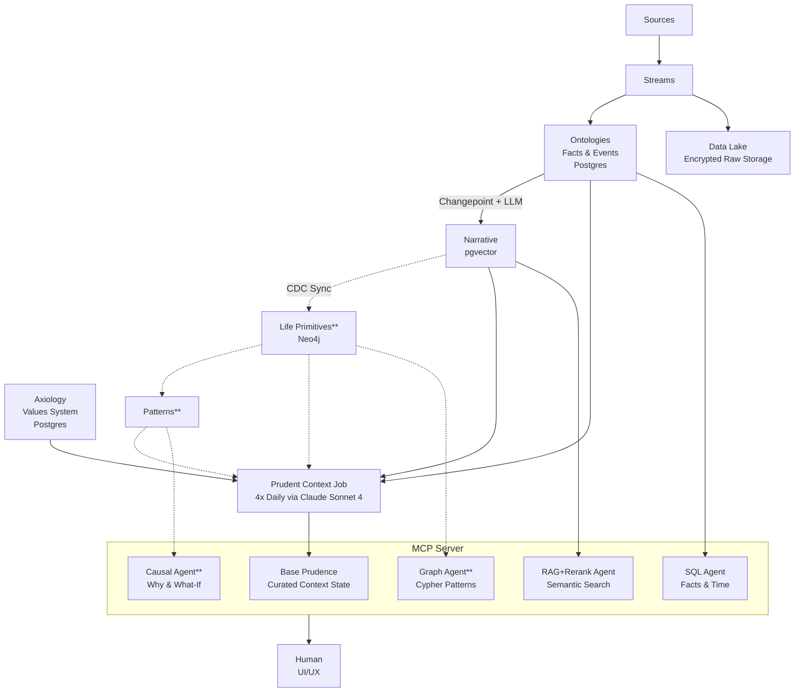
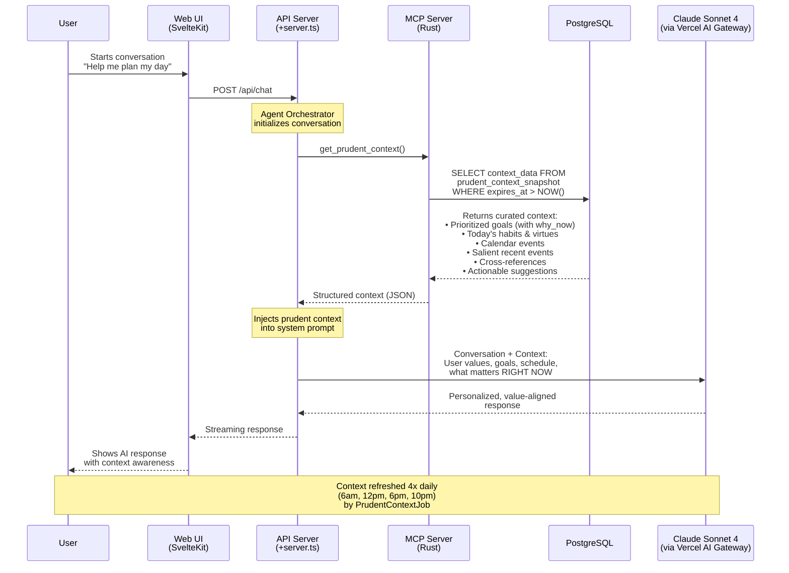
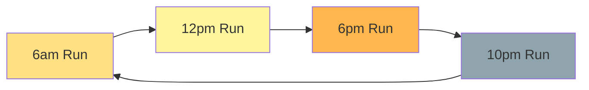

# Ariata Architecture

## Data Pipeline & Query Architecture

---

## Inference Time Architecture

This diagram shows what happens when a user interacts with Ariata's AI assistant at inference time:

### Key Components

#### 1. Prudent Context Snapshot

- Pre-computed baseline context that's refreshed 4x daily
- Contains curated intersection of **Values** (Axiology) and **Facts** (Ontology)
- LLM-prioritized by PRUDENCE: what's timely and relevant RIGHT NOW
- Stored in PostgreSQL as JSONB with expiration timestamp

#### 2. MCP Server

- Exposes `get_prudent_context()` tool to AI assistants
- Provides fast, low-latency context retrieval (no computation at inference time)
- Returns structured data: goals, habits, calendar, events, cross-references

#### 3. Agent Orchestrator

- Manages conversation flow in API layer
- Injects prudent context into system prompt at conversation start
- Routes queries to appropriate retrieval agents (SQL, RAG, etc.)

#### 4. Context Refresh Cycle

Each run queries fresh data from Axiology + Ontology, sends to Claude for curation, and stores with expiration = next scheduled run.

---

## Query Method Comparison

| Method | Layer | Use Case | Example |
|--------|-------|----------|---------|
| **SQL Query** | Ontologies | Factual lookups, time-based filters | "All emails from Sarah last month" |
| **RAG + Rerank** | Narrative | Story-based, semantic search | "When did I feel most creative?" |
| **Graph Traversal** | Life Primitives | Relationship patterns, entity connections | "Who do I meet most often at the gym?" |
| **Causal Inference** | Patterns | Why/what-if questions, root cause | "What caused my productivity spike?" |
| **Value Alignment** | Axiology | Should/telos questions, decision support | "Should I take this opportunity?" |

---

## Technology Stack

| Component | Technology | Purpose |
|-----------|------------|---------|
| **Database** | PostgreSQL 16+ | Streams, Ontologies, Narrative, Axiology, Prudent Context |
| **Vector Search** | pgvector | Semantic similarity for narrative retrieval |
| **Graph Database** | Neo4j | Life primitives, relationship traversal |
| **LLM Provider** | Claude Sonnet 4 (Anthropic) | Narrative generation, prudent context curation |
| **LLM Gateway** | Vercel AI Gateway | Multi-provider LLM routing, API management |
| **MCP Server** | Model Context Protocol (Rust) | Exposes prudent context and tools to AI assistants |
| **Embeddings** | OpenAI ada-002 | Vector embeddings for semantic search |
| **Job Scheduler** | Cron-based (tokio-cron-scheduler) | Scheduled context refresh 4x daily |
| **CDC Pipeline** | Debezium + Kafka (or manual sync) | Postgres → Neo4j sync |

---

## Implementation Status

### Core Data Pipeline (Implemented)

**Data Ingestion:**

- ✅ Sources → Streams (multi-source data ingestion)
- ✅ Streams → Ontologies (ELT transformation to 47 primitives)
- ✅ Ontologies → Narrative (Changepoint detection + LLM generation)

**Values System (Axiology):**

- ✅ Axiology schema (5-level hierarchy: values → telos → goals → patterns → preferences)
- ✅ Telos management (ultimate purpose)
- ✅ Goals tracking (work, character, experiential, relational)
- ✅ Habits, virtues, vices, temperaments

**Prudent Context System:**

- ✅ PrudentContextJob (LLM-curated context generation)
- ✅ Scheduled execution framework (4x daily: 6am, 12pm, 6pm, 10pm)
- ✅ Database schema (prudent_context_snapshot with JSONB storage)
- ✅ MCP Server integration (get_prudent_context tool)
- ⚠️  Scheduler activation (implementation complete, needs activation in server startup)

**Storage:**

- ✅ PostgreSQL (Streams, Ontologies, Narrative, Axiology, Prudent Context)
- ✅ pgvector (Narrative embeddings for semantic search)

**Retrieval:**

- ✅ SQL Agent (query ontologies for facts & time ranges)
- ✅ RAG+Rerank Agent (semantic search on narrative)
- ✅ MCP Server (prudent context retrieval)

**UI/UX:**

- ✅ Vercel AI SDK chat interface
- ✅ Timeline view (chronological narrative)
- ✅ Agent orchestrator with context injection

### Future Development (Post-MVP)

**Data Layers:**

- ❌ Neo4j / Life Primitives (hierarchical graph structure)
- ❌ Patterns (causal inference engine)

**Retrieval Agents:**

- ❌ Graph Agent (Cypher queries on Neo4j)
- ❌ Causal Agent (why/what-if queries)

**Infrastructure:**

- ❌ CDC Pipeline (Debezium + Kafka for Postgres → Neo4j sync)
- ❌ Entity Resolution (fuzzy matching/deduplication)

---

## Key Design Documents

- **[CHANGEPOINT.md](CHANGEPOINT.md)**: Detailed specification for event boundary detection and narrative segmentation
- **[ONTOLOGIES.md](ONTOLOGIES.md)**: Complete ontology schema (47 primitives across 9 domains)
- **[ENTITY_RESOLUTION.md](ENTITY_RESOLUTION.md)**: Entity deduplication strategy (deferred for MVP)

---

**Legend:**

- **Layers without asterisk**: 3-week MVP implementation
- **Layers with `**`**: Post-MVP future development
