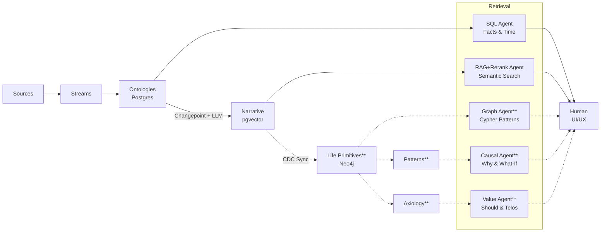

# Ariata Architecture

## Data Pipeline & Query Architecture

---

## Query Method Comparison

| Method | Layer | Use Case | Example | MVP Status |
|--------|-------|----------|---------|------------|
| **SQL Query** | Ontologies | Factual lookups, time-based filters | "All emails from Sarah last month" | ✅ Week 1-2 |
| **RAG + Rerank** | Narrative | Story-based, semantic search | "When did I feel most creative?" | ✅ Week 2-3 |
| **Graph Traversal** | Life Primitives | Relationship patterns, entity connections | "Who do I meet most often at the gym?" | ❌ Post-MVP |
| **Causal Inference** | Patterns | Why/what-if questions, root cause | "What caused my productivity spike?" | ❌ Post-MVP |
| **Value Alignment** | Axiology | Should/telos questions, decision support | "Should I take this opportunity?" | ❌ Post-MVP |

---

## Technology Stack

| Component | Technology | Purpose |
|-----------|------------|---------|
| **Database** | PostgreSQL 16+ | Streams, Ontologies, Narrative storage |
| **Vector Search** | pgvector | Semantic similarity for narrative retrieval |
| **Graph Database** | Neo4j | Life primitives, relationship traversal |
| **LLM Agent** | Claude 3.5 Sonnet | Narrative generation, aggregation |
| **Embeddings** | OpenAI ada-002 | Vector embeddings for semantic search |
| **CDC Pipeline** | Debezium + Kafka (or manual sync) | Postgres → Neo4j sync |

---

## Current Focus

**Data Pipeline:**

- ✅ Sources → Streams (handled by other engineers)
- ✅ Streams → Ontologies (ELT transformation)
- ✅ Ontologies → Narrative (Changepoint detection + LLM generation)

**Storage:**

- ✅ PostgreSQL (Streams, Ontologies, Narrative)
- ✅ pgvector (Narrative embeddings for semantic search)

**Retrieval Agents:**

- ✅ SQL Agent (query ontologies for facts & time ranges)
- ✅ RAG+Rerank Agent (semantic search on narrative)
- ✅ Value Agent (should/telos queries)

**UI/UX:**

- ✅ Vercel AI SDK chat interface
- ✅ Timeline view (chronological narrative)

### What's Deferred (Post-MVP)

**Data Layers:**

- ❌ Neo4j / Life Primitives (hierarchical graph structure)
- ❌ Patterns (causal inference engine)

**Retrieval Agents:**

- ❌ Graph Agent (Cypher queries on Neo4j)
- ❌ Causal Agent (why/what-if queries)

**Infrastructure:**

- ❌ CDC Pipeline (Debezium + Kafka for Postgres → Neo4j sync)
- ❌ Entity Resolution (fuzzy matching/deduplication)

---
