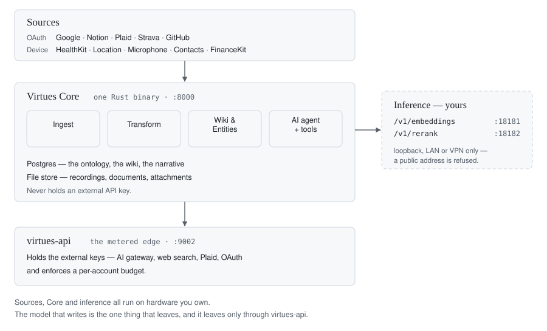
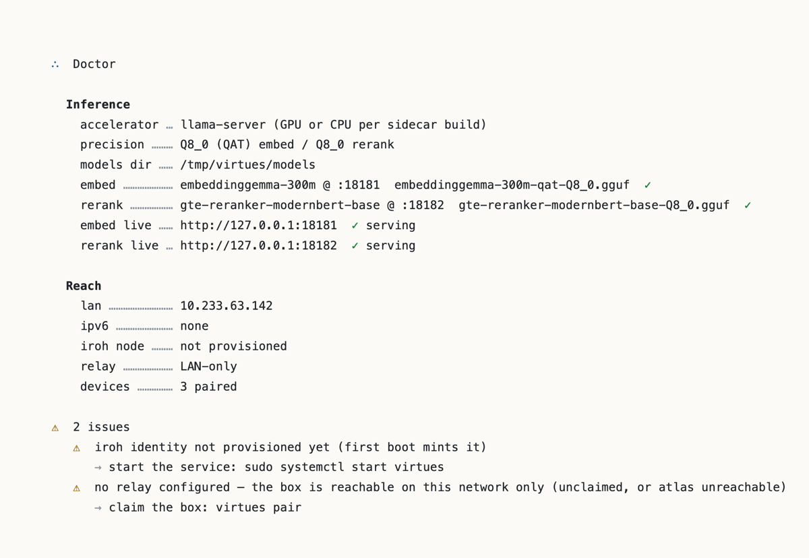

<!--
  ┌─ HEADING CONVENTION (read before editing any # / ## / ### heading) ──────────┐
  Headings are NOT plain markdown text. GitHub's sanitizer strips CSS, so to get
  a serif (Times) heading we render each one as a theme-aware SVG image wrapped in
  a real markdown heading, e.g.:

    ## <picture><source media="(prefers-color-scheme: dark)" srcset=".github/images/headings/h2-foo-dark.svg"></picture>

  Because the heading's visible content is an image (no text), two things follow:
    • The GitHub "Outline" sidebar shows blank labels — accepted tradeoff, which
      is why this file carries a hand-written table of contents under the badges.
    • GitHub can't auto-generate anchors, so each H2/H3 has an explicit
      `<a id="…"></a>` on the line ABOVE it. The TOC links to those ids; some
      headings carry a second, older id so existing deep links keep resolving.

  TO ADD OR EDIT A HEADING (do ALL of these, or you'll get a stale image / dead link):
    1. Edit the heading list in .github/images/headings/gen.py
       (font sizes: H1=34/h40, H2=24/h28, H3=20/h22; weight 400; light+dark each).
    2. Run:  python3 .github/images/headings/gen.py   (regenerates the SVGs).
    3. In this file, update the <picture> block's `alt`, both `srcset`/`src`
       filenames, and the `<a id>` anchor above it. Note gen.py's filename slug
       turns an apostrophe into a hyphen ("After it's running" →
       h3-after-it-s-running) while the anchor drops it ("after-its-running").
    4. Delete the SVG pair for any heading you removed.

  Keep headings short — wide SVGs (>~360px) get scaled down on mobile, breaking
  the visual size hierarchy. Times is a system font; Linux/Android fall back to
  their default serif.

  SCREENSHOTS: shots 1 and 4 are placed. The remaining SHOT comments below
  mark frames nobody has captured yet — replace each with an  once the shot
  exists, and give it alt text describing WHAT IS IN FRAME, not "screenshot".
  Capture against an anonymized copy: tools/anonymize-boxcopy.py.
  └──────────────────────────────────────────────────────────────────────────────┘
-->


# <picture><source media="(prefers-color-scheme: dark)" srcset=".github/images/headings/h1-virtues-dark.svg"></picture>

The trouble with data is not that it is collected, but that it is collected by
everyone except its owner. Ads, algorithms and addictions all run on the
difference.

**∴ Owning the data of your own life is a virtue of our age.**

Virtues is what that ownership looks like in practice. Your days come back
written down, the people and places in them linked, the whole record
searchable — on a server you own, reachable only with a key you hold.


Two ways to run it. **Do it yourself** is the software on your own Linux
machine, installed with one command — the path you can take today, and the one
this README is written for. **[The Virtues Server](https://virtues.com/pre-order)**
is the same binary on a board we build and flash, with a screen on the front,
and it is open for pre-order. Same software either way, and you can always
leave with your data.

[](https://github.com/virtues-os/virtues/actions/workflows/ci.yml)
[](LICENSE)
[](https://discord.gg/sSQKzDWqgv)

**[DIY quickstart](#diy-quickstart)** · [What it does](#what-it-does) ·
[Why it's shaped this way](#why-its-shaped-this-way) ·
[The ontology](#the-ontology) · [Architecture](#architecture) ·
[The full install](#the-full-install) ·
[Reaching your server](#reaching-your-server)
· [Build on it](#build-on-it) · [Development](#development) ·
[Docs](https://virtues.com/docs)

> **Early, and honestly so** — the
> [releases page](https://github.com/virtues-os/virtues/releases) is the only
> current statement of what exists; expect rough edges, and expect us to say
> where they are.

<a id="diy-quickstart"></a>
## <picture><source media="(prefers-color-scheme: dark)" srcset=".github/images/headings/h2-diy-quickstart-dark.svg"></picture>

On a spare Linux machine — a VM is fine:

```bash
curl -sSL https://virtues.com/sh | sudo sh
```

When it asks about inference, choose **"Quick trial"**. It drops in a
CPU-only model server and two small models, no configuration. At the end it
prints a 6-digit code; type that into the desktop app from
[virtues.com/downloads](https://virtues.com/downloads) and you're in. Chat and
day-writing need a model the server can reach, so run
`sudo -u virtues virtues subscribe` or put your own provider key in Settings.

That path is honestly slow and is not a deployment: for real use you run the
two small retrieval models yourself — an embedder and a reranker — on whatever
silicon the machine has, and hand the installer their two URLs. Good pairs to
start from are **embeddinggemma-300m** (768-d, or 256 truncated) or
**gte-small** (384-d) for embedding, with **gte-reranker-modernbert-base** for
reranking — Q8_0 GGUFs of a few hundred megabytes each, served by
`llama-server`, and [The full install](#the-full-install) has the commands.

<a id="what-it-does"></a>
## <picture><source media="(prefers-color-scheme: dark)" srcset=".github/images/headings/h2-what-it-does-dark.svg"></picture>

**It writes your days.** After a day ends, your server reconstructs it from the
evidence — visits, movement, device presence, audio, messages, purchases,
sleep — into a gapless timeline, then writes the diary and epigraph. Its
central doctrine is that **plans are not evidence**: a calendar entry never
names a stretch of your day without a physical trace to corroborate it, so an
uncorroborated plan yields an honest "Unknown" rather than a confident memory
of a day that didn't happen. Each event is then scored for novelty against your
*own* recent life, never a population norm.
[The full design](agents/record/the-day.md).

**It keeps a wiki of the people and places in them.** The Sarah in your
calendar, your contacts, and your messages resolve to one person, with a page
of her own.

<!-- SHOT 2: an entity page: a person, their linked mentions across sources, the events they appear in. Demonstrates entity resolution instead of asserting it. -->

**It answers questions with your actual data**, not a generic profile. The
agent gets read-only SQL over your ontology tables, semantic search across the
whole record, a Python sandbox, web research, and the ability to write pages.
Multi-model — Claude, GPT, Gemini — in three modes: full tools, conversation
only, and read-only research.

<!-- SHOT 3: a chat with `sql_query` running against the owner's own life and the result rendered. The money shot for a technical reader. -->

**Where your data goes, stated plainly.** It is stored on your server and it
stays there. Search runs on your side of the wire — the embedding and reranking
endpoints must be local, and the installer refuses a public address for either.
GPS is reduced to distance and pace before anything is sent anywhere.

The exception is the assistant, and it is not a leak, it is the feature: asking
a question, or letting the server write your day, sends the relevant part of your
record to a model provider — and a voice recording is sent as **audio**, not as
a transcript, to be transcribed. Point Virtues at a local model and that stops
too; the trade is quality and speed, and it is yours to make.

We will not tell you this is private by construction. The relay genuinely
cannot read your data — that is physics; the inference boundary rests on a
contract with a provider, which is a different kind of promise.
[The privacy model](agents/record/privacy-model.md#the-inference-boundary-where-your-data-does-leave)
says exactly what crosses it and what never does.

<a id="why-its-shaped-this-way"></a>
## <picture><source media="(prefers-color-scheme: dark)" srcset=".github/images/headings/h2-why-it-s-shaped-this-way-dark.svg"></picture>

**The virtues of the digital age.** The name does not mean *use technology to
live virtuously*. Virtues change prudently over time — in both their mores and
their requirements — and our age asks for ones the old lists never had to name.
Owning the data of your own life is the first of them, and it stands where
thrift and temperance stood in theirs: what is held about you is what can be
used to move you, and a person who cannot read their own record cannot notice
being moved.

**Digital subsidiarity is the shape that virtue takes in software.** The old
principle that a matter belongs to the smallest competent authority able to
handle it — the household before the city, the city before the state — applied
to the record of a life: *it belongs where the life is lived.* Not in a
datacenter that can read it; not with a company that will outlive its own
interest in keeping it.

Every structural decision here follows from that one, and each is an
incapability rather than a promise: the record is written to your own disk;
retrieval runs against endpoints that must be local, and the installer refuses
a public address for either; nothing inbound is ever opened at home; the relay
moves sealed bytes it has no key to read; and we are not on your allowlist.

The essays are in [the Library](https://virtues.com/library). The engineering
record is in [`agents/`](agents/).

<a id="the-ontology"></a>
## <picture><source media="(prefers-color-scheme: dark)" srcset=".github/images/headings/h2-the-ontology-dark.svg"></picture>

The schema is not an implementation detail here — it *is* the interface. It is
shown to a language model at runtime and it drives a table-driven UI, so a
column name is a term of art in two directions at once.

Everything ingested lands in one of a couple of dozen **registered
ontologies** — the list is
[`crates/virtues-registry/src/ontologies.rs`](crates/virtues-registry/src/ontologies.rs),
and it is what a life looks like once it is normalized:

| Family | Tables |
|---|---|
| Health | `data_health_sleep`, `data_health_workout`, `data_health_heart_rate`, `data_health_hrv`, `data_health_steps` |
| Place | `data_location_visit`, `data_location_point`, `data_environment_weather` |
| People | `data_communication_message`, `data_communication_email`, `data_communication_transcription`, `data_calendar_event` |
| Money | `data_financial_transaction`, `data_financial_account` |
| Attention | `data_activity_app_session`, `data_activity_web_browsing`, `data_content_document`, `data_content_bookmark`, `data_content_conversation` |
| Voice | `data_audio_session` |

Table prefixes are a namespace, not decoration: `data_` is ingested, `wiki_` is
the derived entity graph (`wiki_people`, `wiki_places`, `wiki_orgs`,
`wiki_events`, `wiki_days`), `narrative_` is the life structure
(`narrative_telos` → `narrative_acts` → `narrative_chapters` → days), `app_` is
product state, `search_` is the indexes, `elt_` is pipeline plumbing.

The column names follow a law, because the schema once had **seven** different
names for "when this happened":

- `occurred_at` — an instant, when the thing happened. `started_at` / `ended_at`
for a span.
- `created_at` / `updated_at` — when *we* wrote the row. Never the event; that
conflation is what produced `created_time` sitting beside `created_at`.
- `is_` / `has_` for booleans, never a bare adjective.
- A unit suffix on every quantity: `_cents`, `_ms`, `_bytes`, `_meters`.

The agent's `sql_query` tool reads a catalog of this schema and queries it
read-only, which is the concrete mechanism behind "an AI with real context".
Adding a data type means adding an ontology and a text extractor; the UI and
the search index follow from the descriptor.

<a id="architecture"></a>
## <picture><source media="(prefers-color-scheme: dark)" srcset=".github/images/headings/h2-architecture-dark.svg"></picture>

<!-- Replace with a light/dark SVG pair (same machinery as the headings). -->

<picture>
  <source media="(prefers-color-scheme: dark)" srcset=".github/images/architecture/architecture-dark.svg">
  
</picture>

**Core** is one Rust binary against one Postgres database: ingestion, entity
resolution, the wiki, pages, chat, and the web UI it serves. It never touches
an external API key.

**Retrieval is two HTTP contracts, not code we ship.** Core consumes an
OpenAI-style `/v1/embeddings` endpoint (required) and a `/v1/rerank` endpoint
(optional), and cannot tell what is behind them. On our own board the installer
provisions them on the NPU; on your machine you run them, and the installer
probes what you point it at and pins the model's fingerprint — so a silently
swapped model can't quietly corrupt your index.

**virtues-api** is the metered edge, and **atlas** owns identity and funding
(Stripe on one side, an opaque account id on the other; it never sees usage).
Both live in this repo under `services/`. There is **no managed hosting** —
nobody runs a server for you; those two services exist so the one you run
doesn't have to hold anyone's API keys.

| Source | Streams | Method |
|---|---|---|
| Google | Calendar, Gmail | OAuth |
| Notion | Pages | OAuth |
| Plaid | Transactions, Accounts, Investments, Liabilities | OAuth |
| Strava | Activities | OAuth |
| GitHub | Events | OAuth |
| iOS | HealthKit, Location, Microphone, Contacts, FinanceKit, EventKit | Device |
| macOS | Apps, Browser, iMessage | Device |

<a id="the-full-install"></a>
<a id="install-properly"></a>
<a id="install-linux-home-server"></a>
## <picture><source media="(prefers-color-scheme: dark)" srcset=".github/images/headings/h2-the-full-install-dark.svg"></picture>

<a id="what-to-run-it-on"></a>
<a id="requirements"></a>
### <picture><source media="(prefers-color-scheme: dark)" srcset=".github/images/headings/h3-what-to-run-it-on-dark.svg"></picture>

| Requirement | What, and why |
|---|---|
| **Host OS** | Debian 13+, Ubuntu 24.04 LTS+, or Fedora 40+, `x86_64` or `aarch64`, with systemd and root. A VM is fine; a container is not. |
| **Hardware** | 8 GB RAM and an SSD. **No GPU required** — the model that writes is remote, and of the two local retrieval models only the reranker meaningfully gains from one. |
| **Storage** | NVMe or SATA SSD. The installer classifies *and measures* the disk first: eMMC is workable to ~100k items, microSD is slow and wears out, NFS/SMB is a corruption risk. |
| **Inference** | Two endpoints you run: `/v1/embeddings` (required) and `/v1/rerank` (optional), on loopback, LAN, or VPN — never a public address. |
| **Network** | Outbound 443 only. No port forwarding, no inbound rule, no hostname. |

Machines that clear the bar: a mini PC with 16 GB and an NVMe slot; a used
small-form-factor desktop; an aarch64 SBC with 8 GB and NVMe over PCIe — not
microSD. Full reasoning behind each number in
[What to run it on](docs/setup/requirements.md).

<a id="inference"></a>
### <picture><source media="(prefers-color-scheme: dark)" srcset=".github/images/headings/h3-inference-dark.svg"></picture>

**Start this before you install.** The first thing the installer asks, before
it touches a package or a disk, is where the retrieval models live. We provision inference on exactly one board,
our own; we do not install GPU or NPU inference software on hardware we can't
test, so on your machine you own the endpoints and we validate them at the
door.

[llama.cpp](https://github.com/ggml-org/llama.cpp)'s `llama-server` speaks both
contracts. These are the invocations our own systemd units use:

```bash
# embedder — CPU is the right answer here (fp32 activations)
llama-server --embedding --pooling mean -m embeddinggemma-300m-qat-Q8_0.gguf \
  --host 127.0.0.1 --port 18181 -c 2048 -b 2048 -ub 2048 -np 1 --cache-ram 0 -ngl 0

# reranker — the half that wants a GPU; drop -ngl for CPU
llama-server --rerank --pooling rank -m gte-reranker-modernbert-base-Q8_0.gguf \
  --host 127.0.0.1 --port 18182 -c 2048 -b 2048 -ub 2048 -np 1 --cache-ram 0 -ngl 99
```

`-np 1` and `--cache-ram 0` take each server from ~2.5 GB resident to ~1 GB.
Known-good embedders: **embeddinggemma-300m** (768, Matryoshka to 256),
gte-small (384), bge-small-en-v1.5 (384), e5-small-v2 (384),
nomic-embed-text-v1.5 (768). Known-good rerankers:
**gte-reranker-modernbert-base**, bge-reranker-v2-m3, jina-reranker-v2.

[Setting up inference](docs/inference.md) is the full page: the exact contract,
the prompt-prefix and dimension rules, what the fingerprint pin protects you
from, and how to change model later without losing your record.

<a id="the-command"></a>
<a id="install-in-one-command"></a>
### <picture><source media="(prefers-color-scheme: dark)" srcset=".github/images/headings/h3-the-command-dark.svg"></picture>

```bash
curl -sSL https://virtues.com/sh | sudo sh
```

`virtues.com/sh` is the newest stable release, `sh-pre` the prerelease channel,
and the one you install on is remembered —
[Installing](docs/setup/install.md) covers pinning a version and reading the
script before you run it. On a Virtues Server you run neither: the boot medium
arrives flashed.

In about ten minutes it asks how you want inference and validates your
endpoints, measures the disk, installs Postgres 18 + pgvector and Avahi,
advertises the machine on the LAN as `virtues.local`, starts `virtues.service`
— which mints and keeps the Ed25519 secret that *is* this server's identity —
and prints a **6-digit pair code**.

```bash
sudo -u virtues virtues pair   # prints a fresh code, any time
```

Enter it in the desktop or mobile app
([virtues.com/downloads](https://virtues.com/downloads)). **A browser cannot
pair** — authentication is a held Ed25519 key and a browser tab has none. The
one exception is a browser running *on the server*, trusted as the loopback
console at `http://localhost:8000`.

<a id="commands"></a>
### <picture><source media="(prefers-color-scheme: dark)" srcset=".github/images/headings/h3-commands-dark.svg"></picture>

| Command | What it does |
|---|---|
| `virtues status` | Health in one screen: identity, inference, subscription, devices. `--json` for the same thing in a stable shape, which is what to paste into a support thread |
| `virtues doctor` | How inference resolved, whether both endpoints are actually serving, whether the server is reachable — every finding with the command that diagnoses it |
| `virtues pair` | Print a code to connect a device |
| `virtues device ls` / `add` / `rm <id>` | Who can reach this server. Revoking is real: the next dial is refused |
| `virtues subscribe` | Connect the server to a subscription, so the assistant can reach a model |
| `virtues sudo` | Approve a pending sensitive action — proves physical access |
| `virtues upgrade` / `rollback` | Move between releases on this server's channel — nothing updates itself |
| `virtues channel` | Print or set the release channel this server follows |
| `virtues backup` / `restore` | Snapshot and restore server state |
| `virtues configure-inference` | Re-validate the embedding endpoint after a model change, and offer to re-embed |
| `virtues reindex` | Rebuild the derived search index from source data |
| `virtues uninstall` | Leave. Prints the full manifest of what it found before touching anything |

Two rules explain every `sudo` above: **root** for what changes the machine
(`upgrade`, `restore`, `uninstall`), and the **`virtues` user** —
`sudo -u virtues virtues …` — for what touches the server's own data (`pair`,
`backup`, `subscribe`), because that is the user the daemon runs as.

<a id="after-its-running"></a>
### <picture><source media="(prefers-color-scheme: dark)" srcset=".github/images/headings/h3-after-it-s-running-dark.svg"></picture>

A paired server holds nothing yet. Connect a source in the app — Google, Plaid,
Strava, or a phone streaming HealthKit and location — and the record starts
filling. The search index builds as data lands, and each day is written after
that day has ended rather than live, so the first page worth reading arrives
tomorrow. `virtues status` is where you watch all three.

<a id="where-things-live"></a>
### <picture><source media="(prefers-color-scheme: dark)" srcset=".github/images/headings/h3-where-things-live-dark.svg"></picture>

| What | Where |
|---|---|
| Binary | `/usr/local/bin/virtues` |
| Config | `/var/lib/virtues/virtues.env` — edit, then `sudo systemctl restart virtues` |
| Data | `/var/lib/virtues` — the Postgres cluster and the file store. `DATA_DIR` at install moves it |
| Models | `/var/lib/virtues/models` |
| Units | `virtues`, plus `virtues-embed` / `virtues-rerank` on the bundled path |
| Ports | `8000` server · `5432` Postgres · `18181`/`18182` embed and rerank |
| Logs | `journalctl -u virtues -f` |



**When something breaks:** [When something breaks](docs/operate/recovery.md) is
the owner's page; [agents/build/recovery.md](agents/build/recovery.md) is the
longer runbook behind it.

**The manual** is in [`docs/`](docs/) and publishes to
[virtues.com/docs](https://virtues.com/docs): what to run it on, inference,
installing, reaching your server, upgrading, backup and restore, the CLI.

<a id="reaching-your-server"></a>
<a id="reaching-your-box"></a>
<a id="connect-from-another-machine-v02-preview"></a>
## <picture><source media="(prefers-color-scheme: dark)" srcset=".github/images/headings/h2-reaching-your-server-dark.svg"></picture>

**There is no URL that reaches your server.** Reaching it requires holding a
paired Ed25519 key, not knowing an address.

It is an **iroh endpoint** whose Ed25519 `EndpointId` *is* its identity —
mutual-key auth, no certificate authority. A paired device dials that identity
and iroh finds a path: direct on your LAN, hole-punched across NATs, or bounced
off our relay when neither works. The server dials *out* to the relay, so nothing
inbound is ever opened at home, and it works behind CGNAT, café wifi, and
IPv6-only ISPs — anywhere outbound 443 reaches. The relay moves sealed bytes it
has no key to read; it does see which two keys are talking and how much passes
between them, which is why we call it encrypted end-to-end rather than blind
([walkthrough](agents/archive/relay-walkthrough.html)).

Pairing is **local-first** — no passwords, no email, no magic links: you walk to
the machine, run `virtues pair`, and the code puts the new device's key on the
allowlist. Access is enforced twice —
iroh refuses an unpaired key *before HTTP exists*, and the app-layer bearer
remains the authorization keystone on top. Revocation is real:
`virtues device rm <id>` de-allowlists a key and the next dial is refused. Day
to day you type none of this; the apps hold the key and do the dialing, and on
your home network it answers directly on `:8000`.

<a id="build-on-it"></a>
## <picture><source media="(prefers-color-scheme: dark)" srcset=".github/images/headings/h2-build-on-it-dark.svg"></picture>

**Applets** are the extension system — ingestion and behavior as supervised
subprocesses, in any language, declared by a `manifest.toml`. A new data source
is an applet; so is a scheduled job. See
[`applets/AUTHORING.md`](applets/AUTHORING.md).

**Pages** are collaborative documents (ProseMirror + Yjs) with `[[entity]]`
links into the graph, version history, and AI editing. **Drive** is file storage
on an S3 backend. **MCP** servers plug in as agent tools. Every entity has a
URL, which is what makes the web UI's tabs and split panes work.

<a id="development"></a>
## <picture><source media="(prefers-color-scheme: dark)" srcset=".github/images/headings/h2-development-dark.svg"></picture>

For working on the codebase itself, not for running Virtues in production.

**Prerequisites:** a recent stable Rust toolchain, Node 22+ and pnpm, and — on
macOS — Homebrew, which `make db` uses to provision `postgresql@18` + pgvector
and `make dev` uses to install `llama.cpp` for the local sidecars.

```bash
git clone https://github.com/virtues-os/virtues
cd virtues
make init   # .env with a fresh encryption key
make dev    # postgres + api :9002 + core :8000 + web :5173 + embed/rerank
```

One command runs the whole stack; Ctrl-C stops it. First run fetches ~480 MB of
GGUFs into `.data/`.

```bash
make dev WITH_EMBED=0   # skip the sidecars (search off) — UI-only or low-RAM
make dev-info           # per-tab commands, for split logs
make dev-link           # a login URL for the local stack
make help               # every target
```

Two things that surprise everyone: there is **no `./target`** — the virtues
repos share one cargo target directory set by an untracked `.cargo/config.toml`
— and the crate is `virtues`, not `virtues-core`, so tests are
`cargo test -p virtues --lib`.

Several agents work in this one checkout at the same time, which makes a few
ordinary git commands destructive here. [`CLAUDE.md`](CLAUDE.md) is the working
agreement: branch discipline, how to commit safely, and how to claim a
migration number.

<a id="the-repo"></a>
<a id="project-structure"></a>
## <picture><source media="(prefers-color-scheme: dark)" srcset=".github/images/headings/h2-the-repo-dark.svg"></picture>

```
virtues/
├── virtues-core/            # The heart: Rust daemon (crate `virtues`) — API, ingest, agent, wiki, dayline
├── applets/                 # Extension system: ingestion + behavior as subprocesses
├── crates/                  # Shared libraries: iroh transport, reach client, NPU daemon, registry
├── services/                # The metered cloud edge: virtues-api, atlas
├── apps/                    # Clients: web (also the Tauri iOS/desktop app), desktop helper, mac collector
├── docs/                    # The public manual — publishes to virtues.com/docs
├── agents/                  # The workshop: build contracts, records, plans (never published)
├── tools/                   # bootstrap.sh + virtues-installer (virtues.com/sh)
└── masters/, deploy/, vendor/
```

<a id="security"></a>
## <picture><source media="(prefers-color-scheme: dark)" srcset=".github/images/headings/h2-security-dark.svg"></picture>

Please report vulnerabilities privately — GitHub → **Security** → *Report a
vulnerability* — rather than in a public issue. The threat model, and who holds
which secret (and who deliberately doesn't), is in
[the privacy model](agents/record/privacy-model.md).

<a id="license"></a>
## <picture><source media="(prefers-color-scheme: dark)" srcset=".github/images/headings/h2-license-dark.svg"></picture>

- **Server, web app, and infrastructure** — [BUSL-1.1](LICENSE):
source-available, free to self-host for personal or internal organizational
use, **not** for offering a hosted service or commercial hardware product.
Each file converts to Apache 2.0 four years after release.
- **Native apps and the data model** — MIT (see the `LICENSE` file in those
directories, e.g. `apps/web/plugins/`, `apps/mac-source/`).

The repository default is BUSL-1.1 unless a directory says otherwise.

---

<p align="center"><i>Your data. Your infrastructure. Your narrative.</i></p>