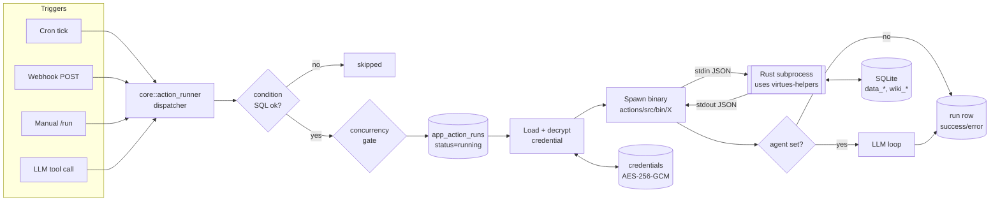
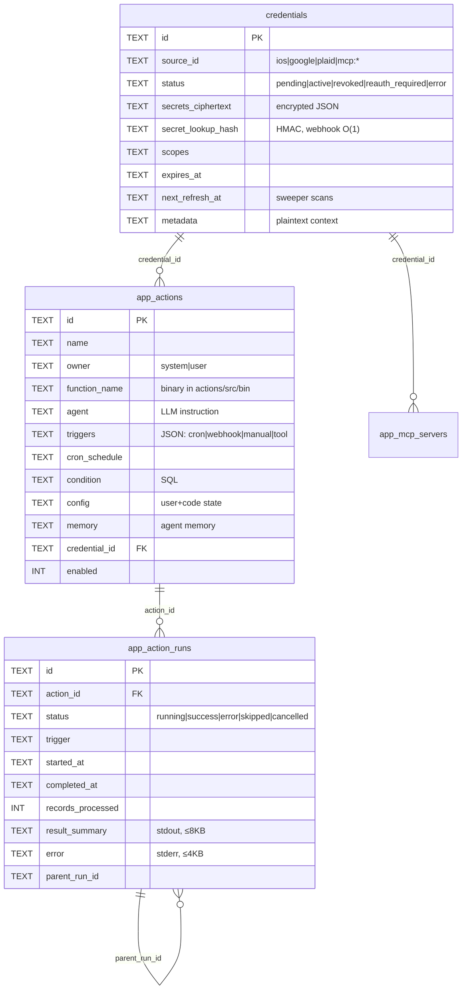
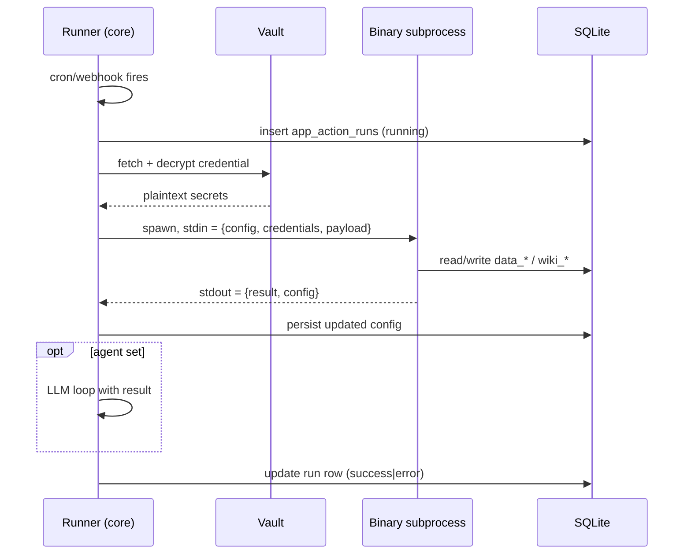

# Virtues — Actions System One-Pager

> Print-friendly architectural reference. Updated 2026-04-28.

## The Paradigm in One Paragraph

Everything that *does work* in Virtues — syncs, transforms, agents, EOD jobs — is an **Action**. An Action is a row in `app_actions` that points at a Rust binary (`function_name`) and/or an LLM instruction (`agent`). The runner spawns the binary as a subprocess with a JSON stdin/stdout contract, optionally feeds the result into the agent phase, and records the run in `app_action_runs`. Secrets for any provider live in a single unified `credentials` Vault, encrypted with AES-256-GCM. Adding a new OAuth provider = **1 source row + 1 proxy route + 1 sync binary**. No new auth Rust.

---

## System Map



---

## Core Tables



**Ontology side** (separate from actions, written *by* actions):
`wiki_people`, `wiki_places`, `wiki_orgs`, plus `data_health_*`, `data_location_*`, `data_finance_*` — all keyed by `source_connection_id` and timestamp.

---

## Three Auth Kinds (the whole story)

| Kind | Used by | Flow | Secret shape |
|---|---|---|---|
| `self_issued_bearer` | iOS, Mac | Server mints token → QR → device stores → device sends on each webhook | `{token}` + `lookup_hash` for O(1) match |
| `via_proxy` | Google, Plaid, OAuth providers | Browser → proxy (holds client_secret) → exchange token → core finalizes | `{access_token, refresh_token, expires_at}` |
| `api_key` | MCP servers, LLM keys | User pastes string → encrypt + store | `{token}` or multi-field |

**Status machine:** `pending → active ⇄ reauth_required/error → revoked` (terminal).

---

## Action Lifecycle (Subprocess Contract)



**Exit 0 = success.** Anything else = error, captured as `error` (≤4KB).

---

## Layout on Disk

```
actions/                        → 11 binary targets
  src/bin/{name}/main.rs        → ios_healthkit, google_calendar_sync, …
  templates.toml                → [[source]] + [[action]] declarations
  helpers/ (virtues-helpers)    → contract, auth/, crypto/, db, entity, dedup

core/
  src/action_runner/mod.rs      → unified dispatcher
  src/scheduler/actions.rs      → Action / ActionRun models + CRUD
  src/scheduler/mod.rs          → cron ticker
  src/server/webhook.rs         → POST /webhook/{action_id}
  src/api/auth.rs               → 5 handlers: pair_initiate/complete,
                                  oauth_start/callback, apikey_complete
  migrations/
    002_entities.sql            → wiki_people / wiki_places / wiki_orgs
    003_ontology.sql            → data_* tables
    050_actions_cutover.sql     → app_actions + app_action_runs
    055_credentials_create.sql  → unified credentials vault

ACTIONS.md                      → 707-line full spec (source of truth)
```

---

## Templates.toml — User vs Code Ownership

| Field | Owner | On reconcile |
|---|---|---|
| `cron_schedule`, `config`, `enabled`, `memory` | **User** | Preserved |
| `function_name`, `triggers`, `agent`, `condition`, `owner`, `name` | **Code** | Overwritten |

`per_credential = true` ⇒ fan out one `app_actions` row per active credential of the linked source.

---

## The Forcing Function

> *"The next 10 redirect-based providers should require only one `[[source]]` row + one proxy route + one sync binary. If any requires more, the architecture has drifted."* — ACTIONS.md

If you're writing new auth code to add a provider, stop and re-read the auth/ helpers.

---

## Quick Reference

- **Encryption key:** `VIRTUES_ENCRYPTION_KEY` (32 bytes, base64)
- **Algorithm:** AES-256-GCM, 12-byte nonce per write
- **HMAC pepper domains:** `credentials.lookup.v1`, `oauth.state.v1`
- **Webhook auth:** `Bearer <token>` → HMAC → `secret_lookup_hash` → O(1) credential lookup → assert matches `action.credential_id`
- **Truncation:** `result_summary ≤ 8KB`, `error ≤ 4KB`
- **Concurrency default:** skip if previous run still active (override with `concurrency_mode='parallel'`)
